# Fivetran + Iceberg + Snowflake (Azure)

Connect Fivetran to Azure ADLS Gen2 as an Apache Iceberg destination, then integrate with Snowflake to query open lakehouse data using a catalog-linked database.

!!! warning "Adapt to Your Environment"
    This guide is a reference implementation demonstrated in a simplified environment.
    Your networking, security policies, IAM configurations, and infrastructure will differ.
    Always validate against your organization's requirements before implementing.

## Architecture

```
Azure SQL Database
       │
       ▼
   Fivetran
       │
       ▼
  Azure ADLS Gen2  ◄──  Iceberg Tables
       │
       ▼
   Snowflake
   (Catalog-Linked Database)
```

## Prerequisites

- Azure account with permissions to create storage accounts, app registrations, and role assignments
- Fivetran account (a [free trial](https://fivetran.com/signup) works) with permissions to configure connectors and destinations
- Snowflake account (a [free trial](https://signup.snowflake.com/) works) with `ACCOUNTADMIN` role
- An Azure SQL Database with data to sync (or another supported Fivetran source)

---

## 1. Provision Cloud Storage (Azure ADLS)

Create an Azure Storage Account with ADLS Gen2 to store Iceberg tables written by Fivetran.

!!! abstract "What's happening"
    At this stage, you are creating the cloud storage layer where Fivetran will write Iceberg data files and metadata. Think of this as provisioning the "landing zone" for your open lakehouse.

!!! note "Environment-Specific"
    The storage account settings below are for demonstration. Consult your cloud/security team
    for your organization's required networking, encryption, and access configurations.

### Create a Storage Account

**1.** In the Azure Portal, search for **Storage accounts** and select it.

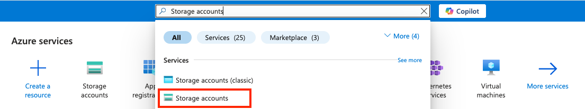

<br>

**2.** Click **Create**.

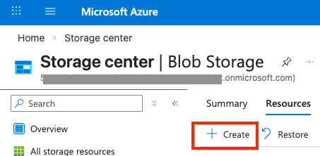

<br>

**3.** Fill in the **Basics** tab:

| Setting | Value |
|---------|-------|
| **Subscription** | Your Azure subscription |
| **Resource group** | Create new or select existing |
| **Storage account name** | Must be globally unique (e.g., `timjonesiceberg`) |
| **Region** | East US 2 (match your Snowflake region if possible) |
| **Preferred storage type** | Azure Blob Storage or Azure Data Lake Storage Gen 2 |
| **Performance** | Standard |
| **Redundancy** | Locally-redundant storage (LRS) — adjust to your requirements |

Click **Next: Advanced**.

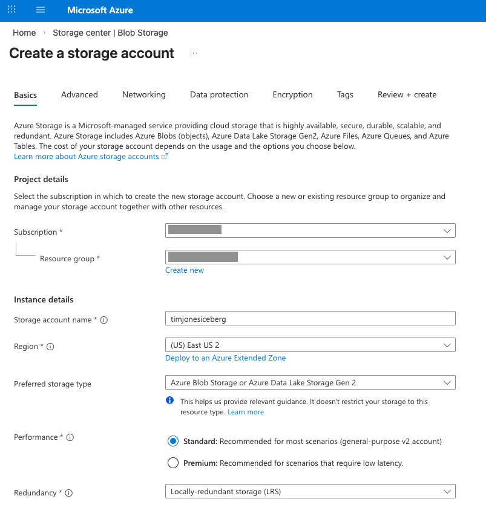

<br>

**4.** On the **Advanced** tab, leave all defaults **except**:

!!! danger "Critical Setting"
    **Enable hierarchical namespace** must be checked. This is what makes the storage account
    ADLS Gen2 rather than standard Blob Storage. Without this, the Iceberg integration will not work.

!!! tip
    Review all other settings on this tab with your internal security team.

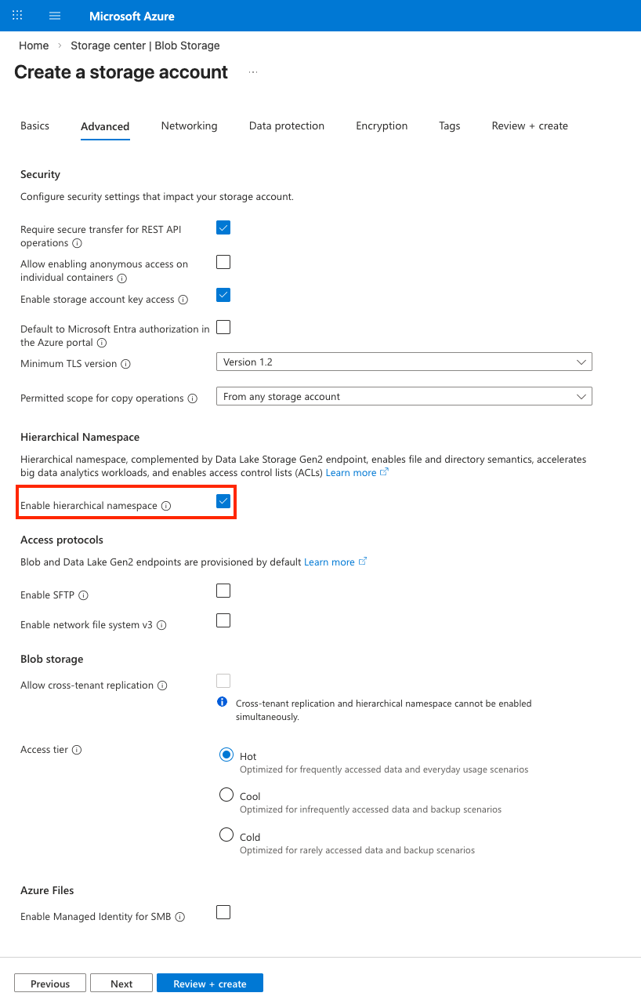

<br>

**5.** On the **Networking** tab, all defaults were left as-is for this demo.

!!! note
    Review networking settings against your internal networking requirements. Your organization
    may require private endpoints, specific firewall rules, or restricted virtual network access.

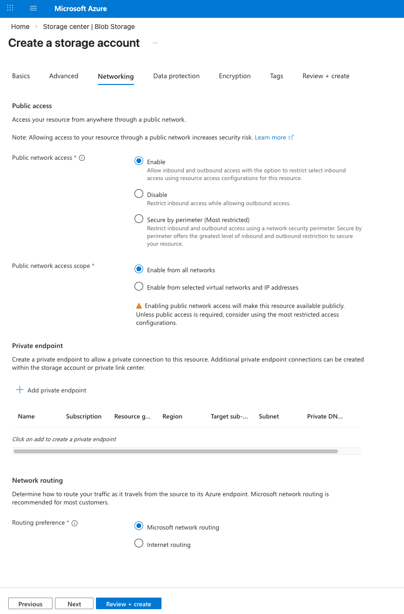

<br>

**6.** On the **Data protection** tab, uncheck **Enable soft delete for file shares**.

This setting applies to Azure Files, which we are not using in this setup.

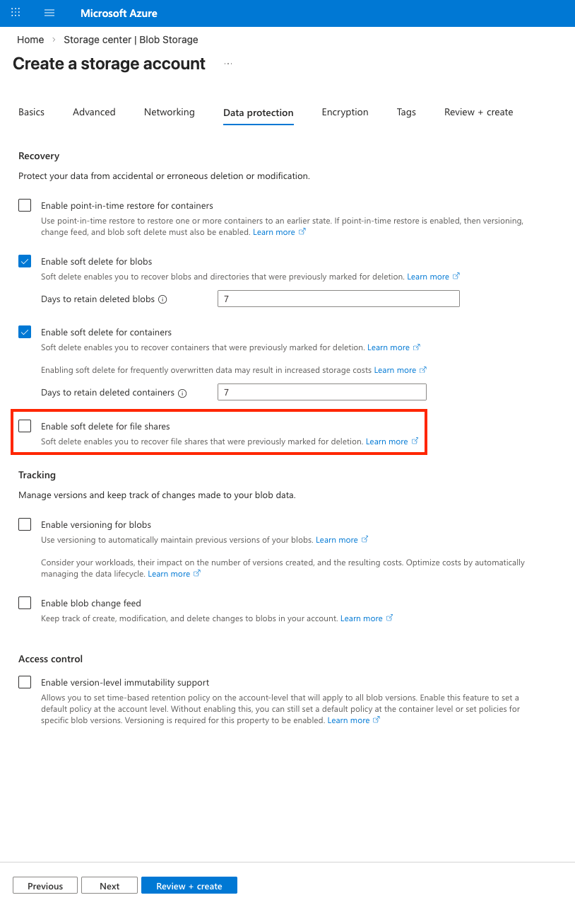

<br>

**7.** On the **Encryption** tab, all defaults were left as-is.

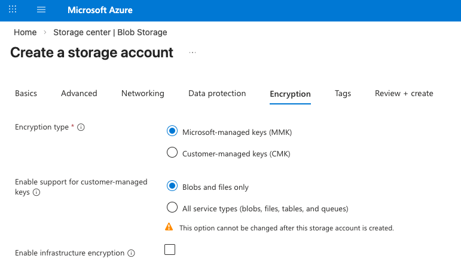

<br>

**8.** On the **Tags** tab, no tags were added for this demo.

!!! tip
    In production, add tags that align with your organization's requirements (e.g., `Environment`, `Owner`, `CostCenter`).

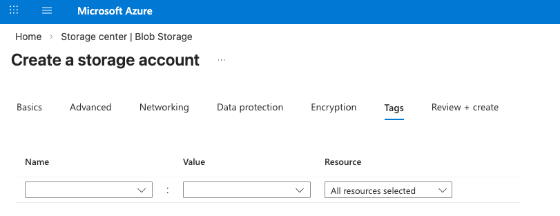

<br>

**9.** Navigate to **Review + create**, review all selections, and click **Create**.

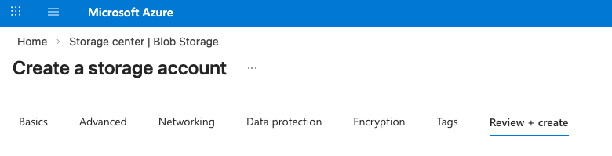

<br>

**10.** Once deployment completes, click **Go to resource**.

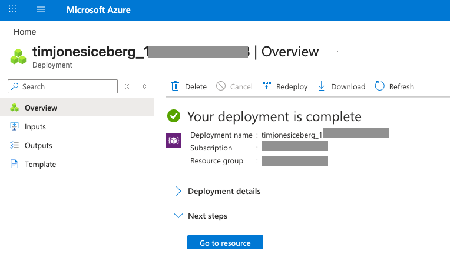

### Create a Container

<br>

**11.** In the left-hand pane, navigate to **Data storage** and select **Containers**.

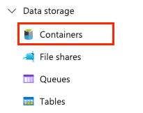

<br>

**12.** Click **+ Add container**.

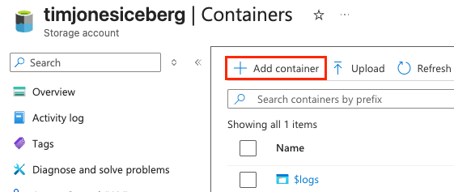

<br>

**13.** Give the container a name (e.g., `landing`) and keep all defaults. Click **Create**.

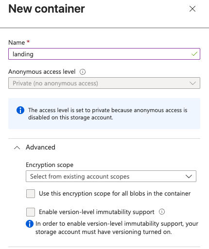

!!! success "Storage Setup Complete"
    Your Azure Storage Account and ADLS Gen2 container are now provisioned and ready for Fivetran to write Iceberg data.

---

## 2. Enable Fivetran Access to ADLS

Create an Azure service principal so Fivetran can write Iceberg data to your ADLS container.

!!! abstract "What's happening"
    Fivetran needs authenticated access to write files into your ADLS container. Here you are creating a service principal (an identity for Fivetran) and granting it permission to read and write blob data in your storage account.

### Register an App (Service Principal)

**14.** In the Azure Portal, search for **App registrations** and select it.

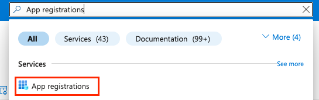

<br>

**15.** Click **+ New registration**.

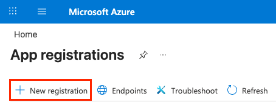

<br>

**16.** Give the application a descriptive name (e.g., `fivetran-adls-access-timjones`). Select the appropriate account type for your organization. Click **Register**.

!!! tip
    Write down the application name you chose — you will need it later when assigning storage permissions.

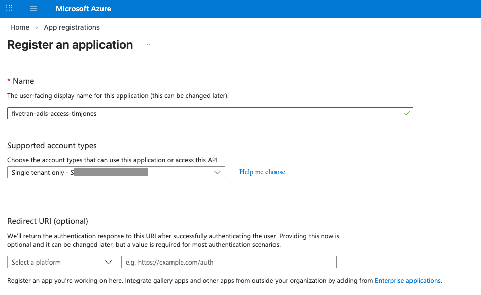

<br>

**17.** On the app overview page, copy the **Application (client) ID** and **Directory (tenant) ID**. Save these in a secure location — you will need them later.

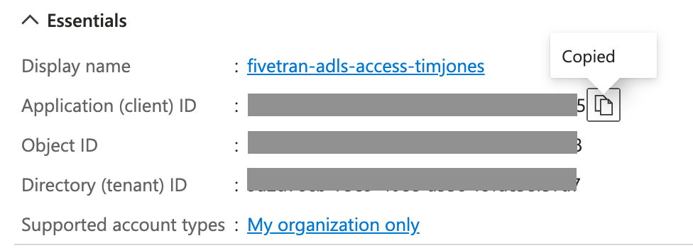

### Create a Client Secret

<br>

**18.** In the left-hand pane under **Manage**, select **Certificates & secrets**.

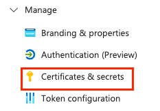

<br>

**19.** Click **+ New client secret**.

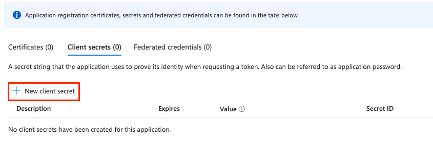

<br>

**20.** Give the secret a description and set the expiration according to your organization's requirements.

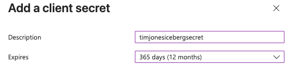

<br>

**21.** Copy the **Value** and store it in a secure location. This is your client secret — it will not be shown again.

!!! danger "Important"
    The client secret value is only displayed once. If you lose it, you will need to create a new secret.

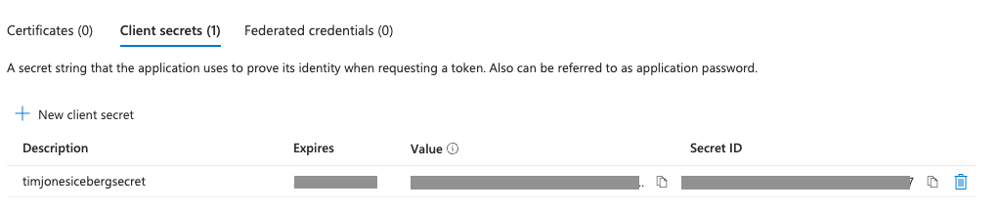

<br>

### Assign Storage Permissions

Now we allow this service principal to access your ADLS storage account.

**22.** Navigate back to the storage account created in Section 1 by searching for its name in the Azure Portal search bar. In the left-hand pane, click **Access Control (IAM)**.

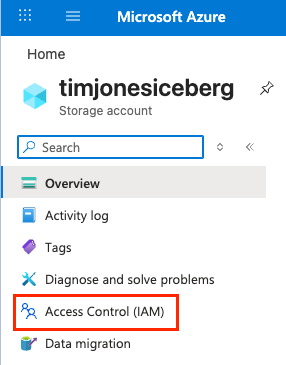

<br>

**23.** Click **Add role assignment**.

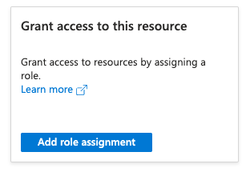

<br>

**24.** Search for **Storage Blob Data Contributor**, select the role, and click **Next**.

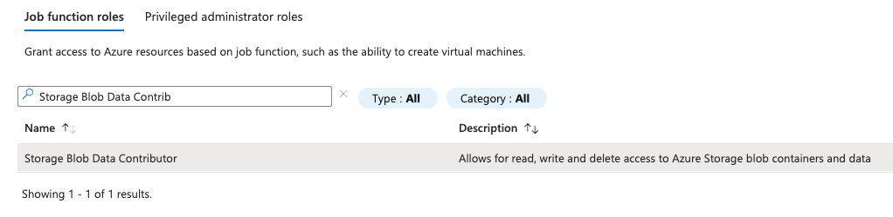

<br>

**25.** Click **+ Select members**.

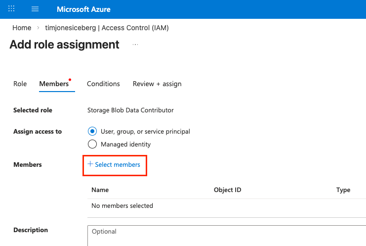

<br>

**26.** In the **Select members** pane on the right, search for the name you used when registering the application. Select it, then click **Select** at the bottom.

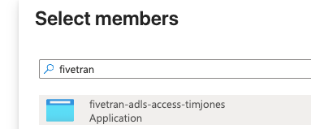

<br>

**27.** Add any **Conditions** if applicable to your organization. No conditions were added in this demo. Then click **Review + assign**.

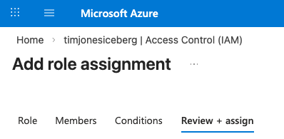

!!! success "Fivetran Access Setup Complete"
    You will see a notification confirming the role assignment was successful. Your service principal now has read/write access to the ADLS storage account and is ready for Fivetran to use.

---

## 3. Configure Fivetran Data Pipeline

Set up a Fivetran destination to write Iceberg tables to your ADLS container.

!!! abstract "What's happening"
    In this section, you are telling Fivetran *where* to write data (the ADLS destination) and *what* data to sync (the source connector). Once the initial sync completes, Fivetran will continuously write Iceberg data files and metadata into your ADLS container on an ongoing schedule.

### Create an ADLS Destination

**28.** Log in to Fivetran and navigate to the **Destinations** tab in the left-hand sidebar.

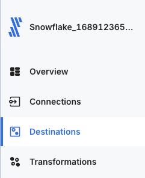

<br>

**29.** Click **+ Add destination** in the top right-hand corner.


<br>

**30.** Search for **Azure Data Lake Storage** and click **Set up**.

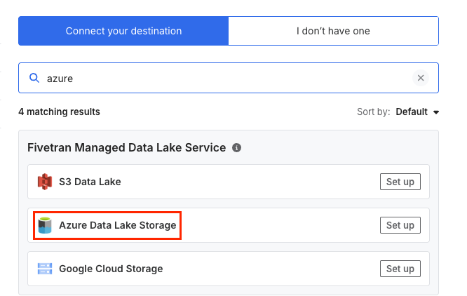

<br>

**31.** Give the new destination a descriptive name.

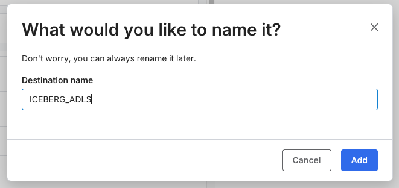

<br>

**32.** Fill in the destination details using the Azure configurations from Section 2:

| Fivetran Field | Azure Value |
|----------------|-------------|
| **Client Id** | Application (client) ID from the app registration |
| **Tenant Id** | Directory (tenant) ID from the app registration |
| **Client Secret** | The client secret value you saved |

!!! tip
    The **Application (client) ID** maps to Fivetran's **Client Id** field, and the **Directory (tenant) ID** maps to the **Tenant Id** field.

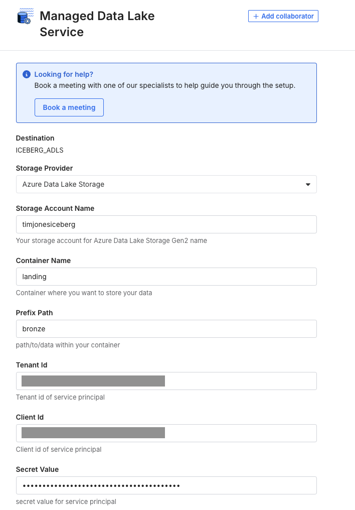

<br>

**33.** Do **not** select the OneLake or Unity options — we will use the default Fivetran REST Catalog, which uses the Polaris catalog. Configure the remaining options as required by your organization.

!!! abstract "What's happening"
    The Fivetran REST Catalog tracks the location and schema of every Iceberg table Fivetran writes. Snowflake will later connect to this catalog to discover tables — rather than scanning files directly.

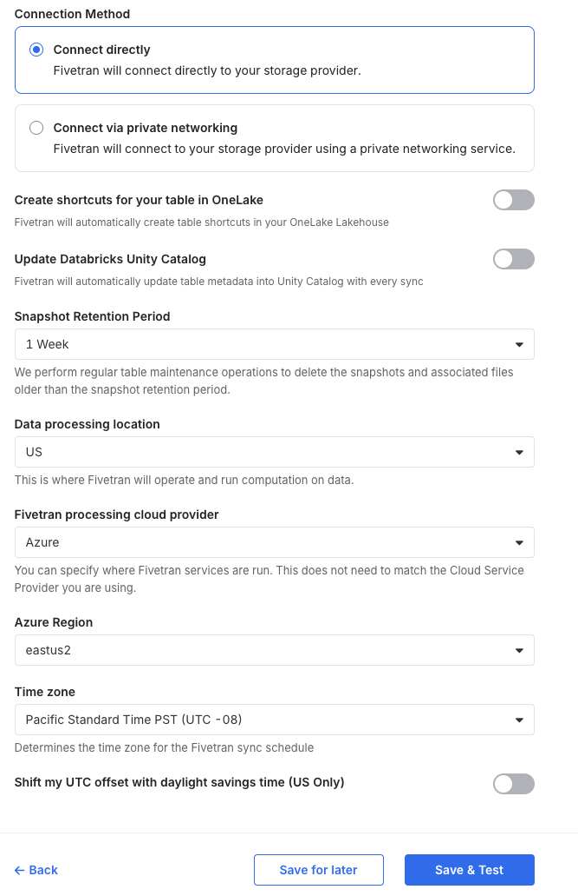

<br>

**34.** Click **Save & Test** and ensure all connection tests pass. Once successful, click **View Destination** at the bottom to see the destination details.

!!! success "Destination Configured"
    Your Fivetran ADLS destination is now configured and ready to receive data as Iceberg tables.

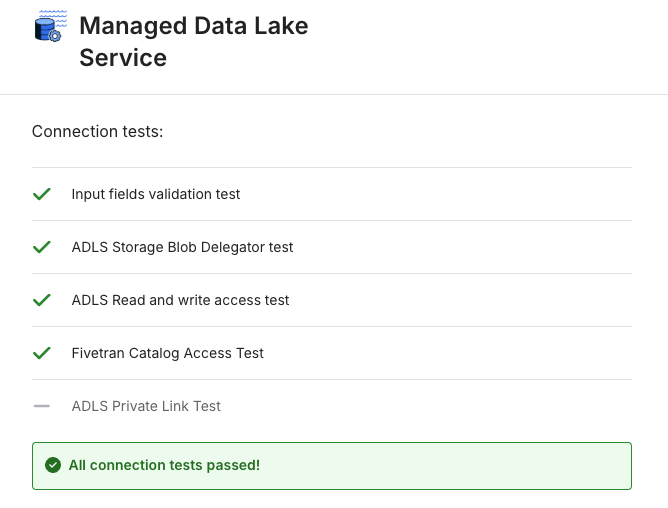

### Create a Source Connection

<br>

**35.** Navigate to the **Connections** tab in the left-hand sidebar.

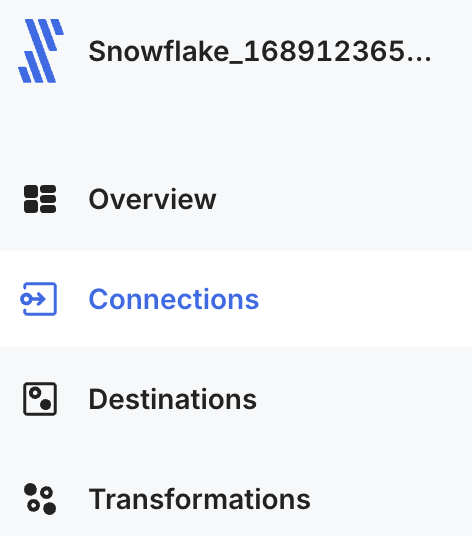

<br>

**36.** You will see a connection for **Fivetran Platform** with your ADLS destination. This is normal — the Fivetran Platform Connector is a specialized, free connector that exports your Fivetran audit logs, usage metrics, and account metadata (like connector status and sync history) into a schema in your destination. It provides visibility into data lineage, monitoring of connector performance, and control over operational costs.

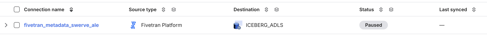

<br>

**37.** Click **+ Add connection** in the top right-hand corner.

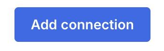

<br>

**38.** Search for your source connector. In this tutorial, we are using **Azure SQL Database**. Click **Set up** for your connector.

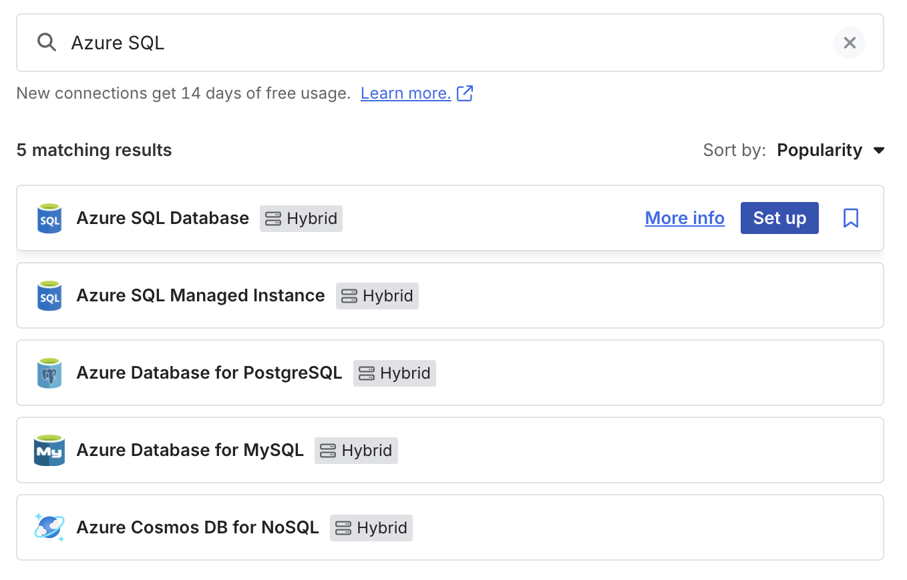

<br>

**39.** Select the ADLS destination you just set up.

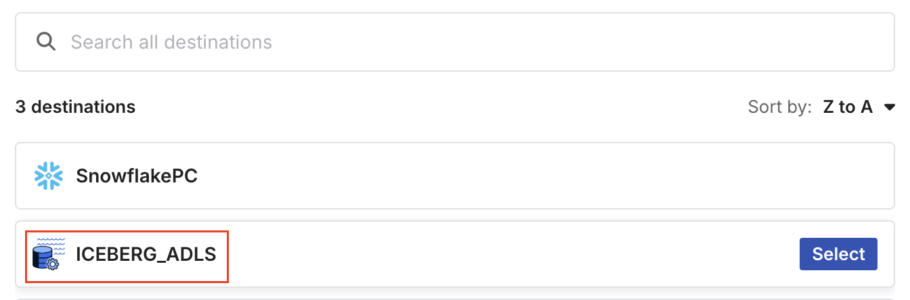

<br>

**40.** Configure the connection details for your source. For **Authentication Method**, select the option required by your organization's requirements.

!!! note "Source-Specific"
    The configuration fields will vary depending on the source connector you selected. Refer to the [Fivetran documentation](https://fivetran.com/docs/connectors) for your specific source.

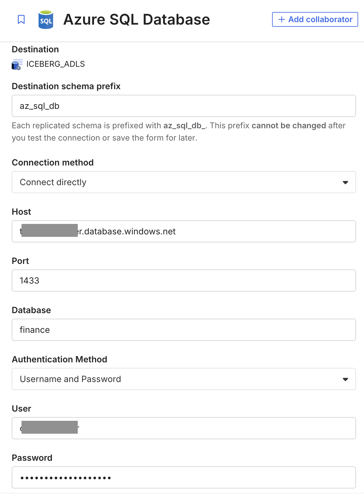

<br>

**41.** Copy the Fivetran IPs listed and whitelist them in your source's firewall so that Fivetran can access it. Once whitelisted, click **Save & Test**.

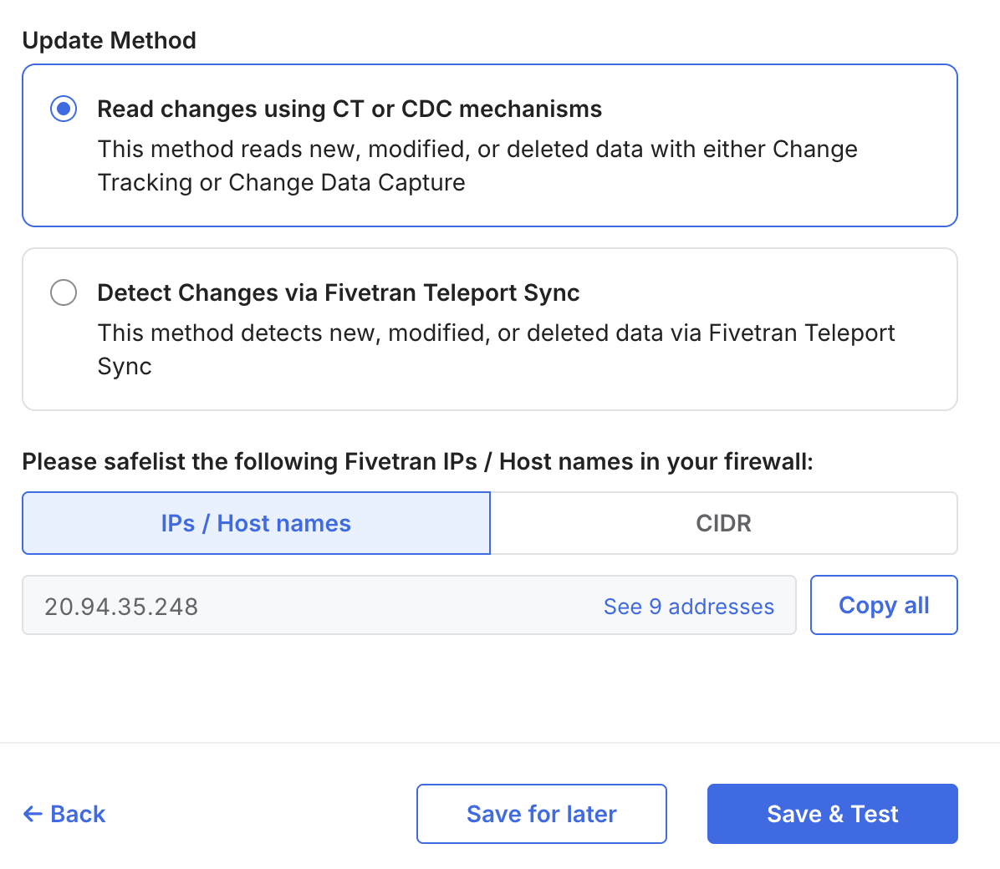

<br>

**42.** After whitelisting the Fivetran IPs on your firewall, test the connection and ensure all connection tests pass. Click **Continue**.

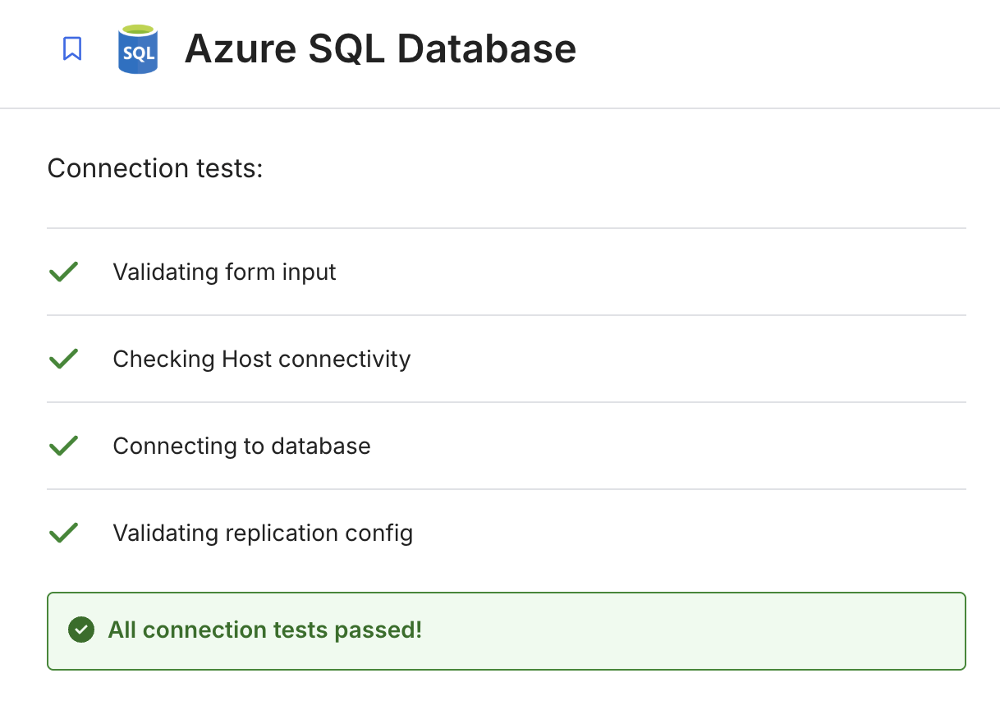

<br>

**43.** Select the data you want to sync, then click **Save & Continue**.

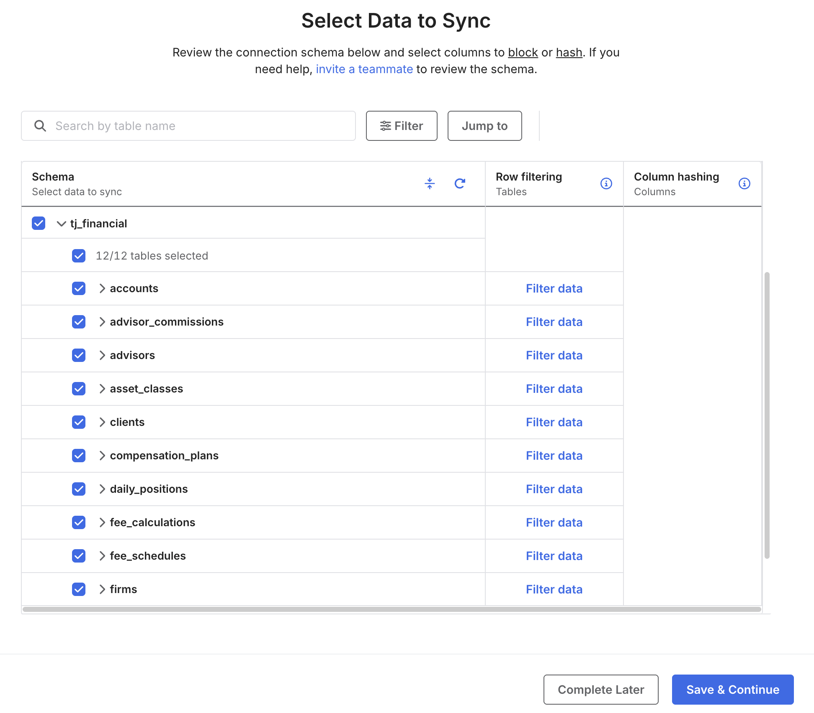

<br>

**44.** Determine how you want Fivetran to detect changes in your source data.

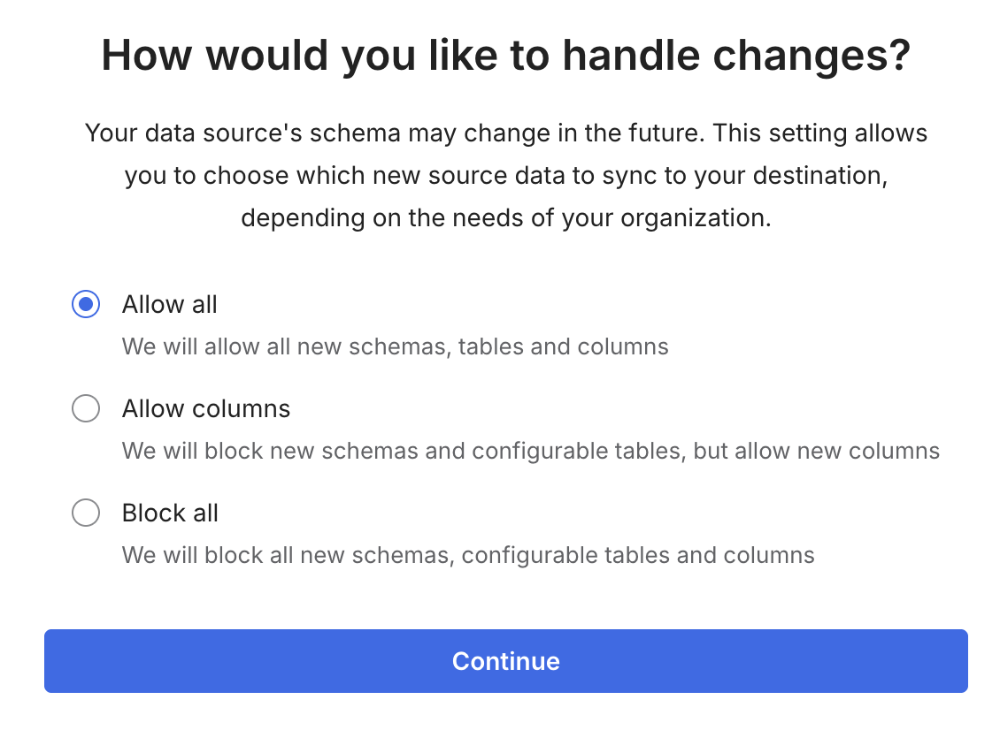

<br>

**45.** Click **Start Initial Sync** to begin syncing data from your source to ADLS as Iceberg tables.

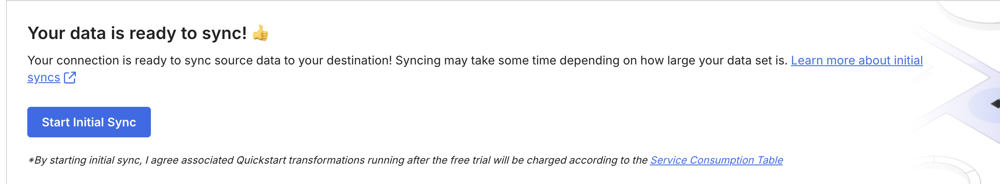

<br>

**46.** You will see a message confirming the historical sync was successful.

!!! success "Fivetran Pipeline Complete"
    Your data is now syncing from your source into ADLS as Iceberg tables. Fivetran will continue to sync changes on the schedule you configured.

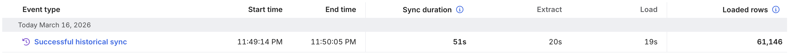

---

## 4. Connect Snowflake to ADLS Iceberg Data

Create a Snowflake external volume and catalog integration so Snowflake can access the Iceberg tables in your ADLS container.

!!! abstract "What's happening"
    Here you are creating two Snowflake objects: an **external volume** (tells Snowflake *where* the Iceberg files live in ADLS) and a **catalog integration** (tells Snowflake *how* to discover tables via the Fivetran REST Catalog). Snowflake connects to the catalog — it does not scan the storage files directly.

**47.** In Fivetran, navigate to **Destinations**, select your ADLS destination, and go to the **Catalog Integration** tab. Select **Snowflake** and copy the generated code.

!!! info
    This code will create two Snowflake objects:

    - An **External Volume** — tells Snowflake where your Iceberg data lives in ADLS. [Learn more](https://docs.snowflake.com/en/user-guide/tables-iceberg-configure-external-volume).
    - A **Catalog Integration** — connects Snowflake to the Fivetran REST Catalog so it can discover and read your Iceberg tables. [Learn more](https://docs.snowflake.com/en/user-guide/tables-iceberg-configure-catalog-integration).

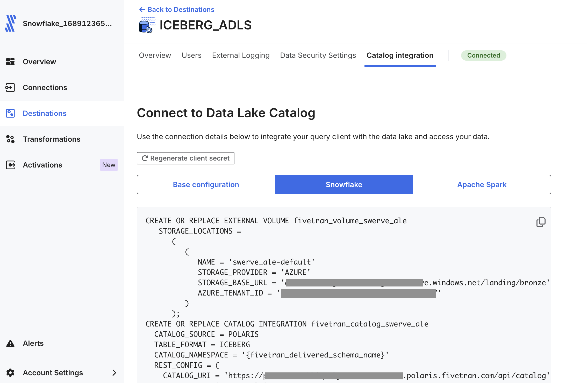

<br>

**48.** Run the external volume statement in Snowflake. It should execute successfully.

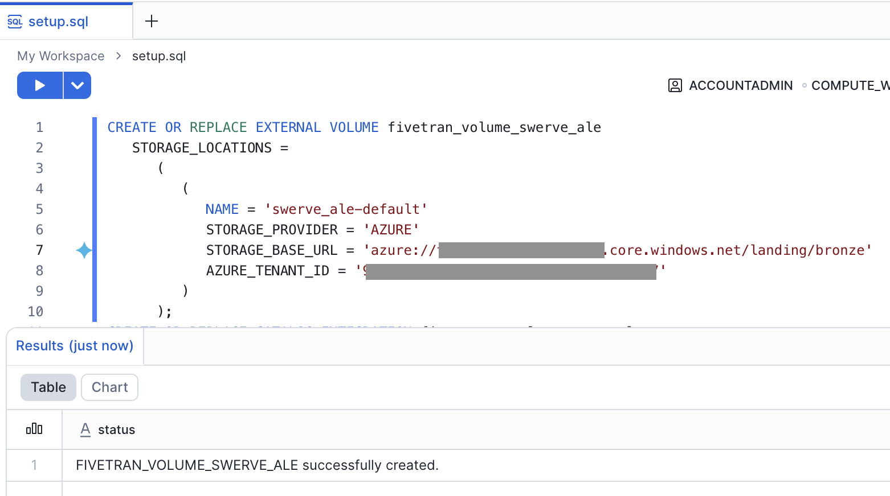

<br>

**49.** Run the catalog integration statement in Snowflake. It should also execute successfully.

!!! success "Snowflake Integration Complete"
    Your external volume and catalog integration are now configured. Snowflake can access your ADLS Iceberg data through the Fivetran REST Catalog.

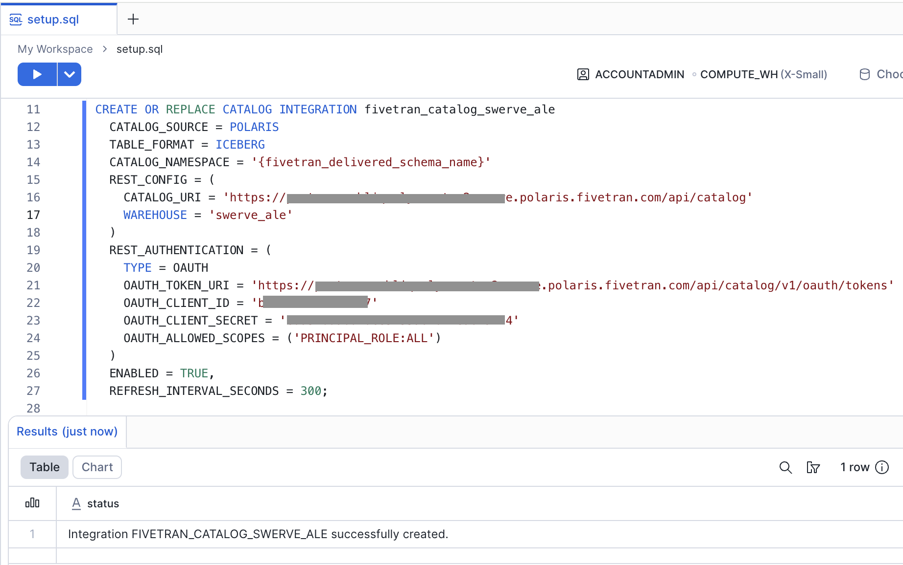

<br>

**50.** Run the following command to describe the external volume and retrieve its properties:

```sql
DESC EXTERNAL VOLUME <external_volume_name>;
```

!!! warning
    Run the following query **immediately** after the `DESC EXTERNAL VOLUME` command — it uses `LAST_QUERY_ID()` to parse the results.

```sql
SELECT 
    PARSE_JSON("property_value"):AZURE_MULTI_TENANT_APP_NAME AZURE_MULTI_TENANT_APP_NAME,
    PARSE_JSON("property_value"):AZURE_CONSENT_URL AZURE_CONSENT_URL,
    PARSE_JSON("property_value"):NAME AS NAME ,
    PARSE_JSON("property_value"):STORAGE_REGION STORAGE_REGION,
    PARSE_JSON("property_value"):AZURE_TENANT_ID AZURE_TENANT_ID
FROM TABLE(RESULT_SCAN(LAST_QUERY_ID()))
WHERE "property" = 'STORAGE_LOCATION_1';
```

### Grant Snowflake Access to ADLS

!!! abstract "What's happening"
    When you created the external volume, Snowflake generated its own service principal in Azure. You now need to grant this Snowflake-managed identity the same storage permissions so Snowflake can read the Iceberg files written by Fivetran.

**51.** Navigate back to your storage account in the Azure Portal. Go to **Access Control (IAM)** and click **Add role assignment**.

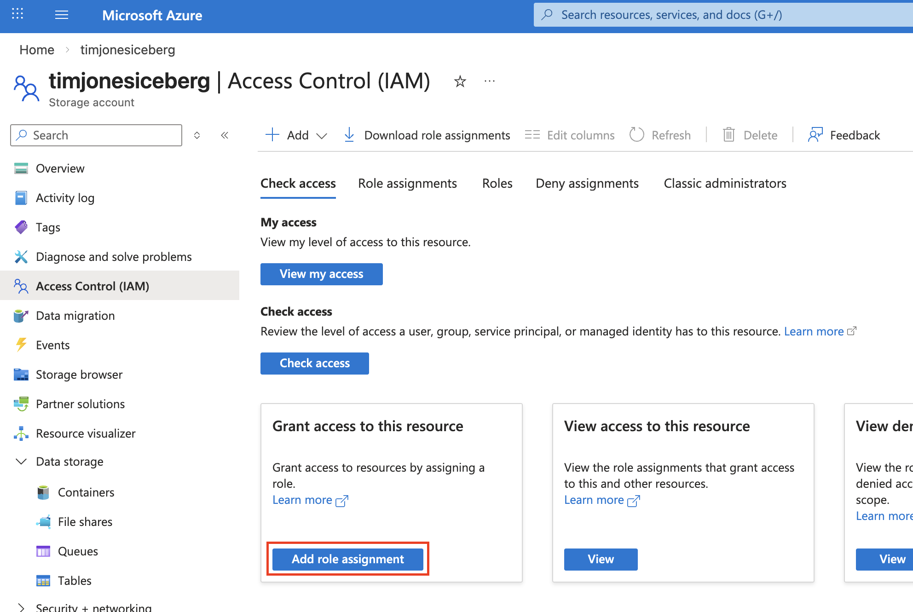

<br>

**52.** Search for **Storage Blob Data Contributor**, select the role, and click **Next**.

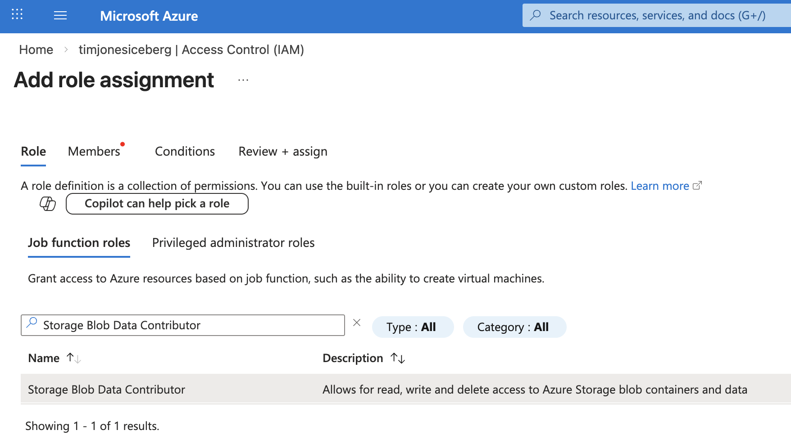

<br>

**53.** Under **Members**, click **+ Select members**. Search for the Snowflake-generated service principal using the value from `AZURE_MULTI_TENANT_APP_NAME` (name will vary).

!!! tip
    Remove everything after the underscore in the `AZURE_MULTI_TENANT_APP_NAME` value — that portion is a timestamp. Only search for the text before the underscore.

Select the application, then click **Select** at the bottom. Leave **Conditions** as-is and click **Review + assign**.

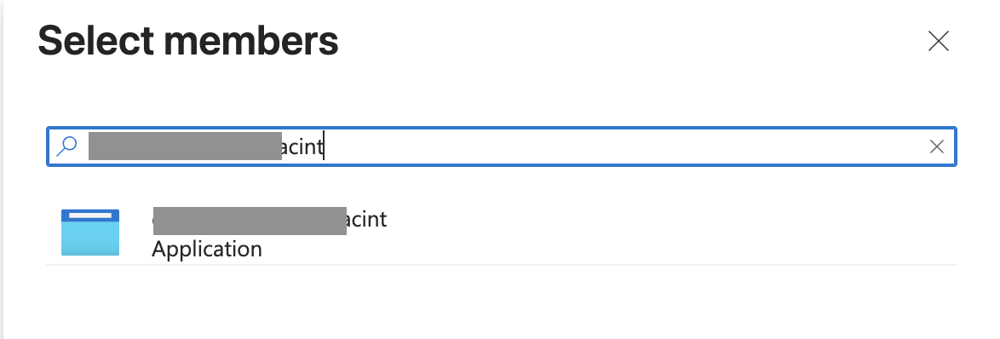

<br>

**54.** Copy the `AZURE_CONSENT_URL` from the query results and paste it into your browser. Sign in as an Azure Admin and approve the application. This allows Snowflake's service principal to access your tenant.

Wait 1–2 minutes for Azure RBAC propagation, then run the following in Snowflake to verify the external volume is working:

```sql
SELECT SYSTEM$VERIFY_EXTERNAL_VOLUME('external_volume_name') as Test;
```

Ensure the output begins with `"success":true`.

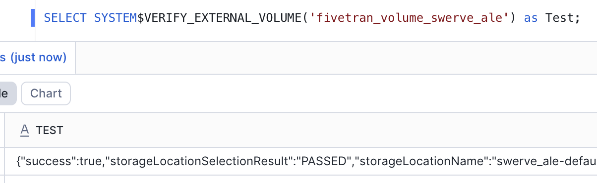

!!! success "External Volume Verified"
    Snowflake can now read and write to your ADLS storage account.

---

## 5. Create a Catalog-Linked Database

Create a catalog-linked database in Snowflake that auto-discovers schemas and tables from the Fivetran catalog.

!!! abstract "What's happening"
    A catalog-linked database is a Snowflake database that is backed by an external catalog — in this case, the Fivetran REST Catalog. Snowflake automatically discovers and registers all schemas and tables from the catalog. As Fivetran syncs new data, the tables appear in Snowflake without any manual DDL.

**55.** Run the following command to create a catalog-linked database. Name the database based on what makes the most sense for your data source.

```sql
CREATE OR REPLACE DATABASE iceberg_fivetran_adls
  LINKED_CATALOG = (
    CATALOG = 'catalog_integration_name_here'
  )
  EXTERNAL_VOLUME = 'external_volume_name_here';
```

!!! success "Catalog-Linked Database Created"
    Your catalog-linked database is now created. Snowflake will auto-discover schemas and tables from the Fivetran Iceberg catalog.

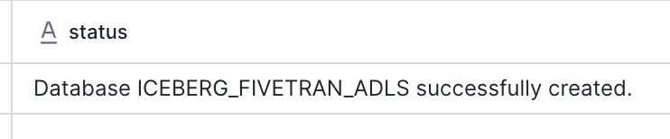

<br>

**56.** Describe the database to see the schemas and tables that were auto-discovered:

```sql
DESCRIBE DATABASE iceberg_fivetran_adls;
```

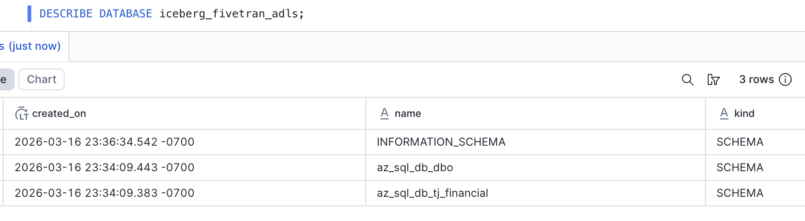

<br>

**57.** Navigate to the **Database Explorer** in Snowflake to see the new catalog-linked database, its schemas, and tables. As new data arrives through the linked catalog, it will automatically be queryable and discoverable here — no manual table creation required.

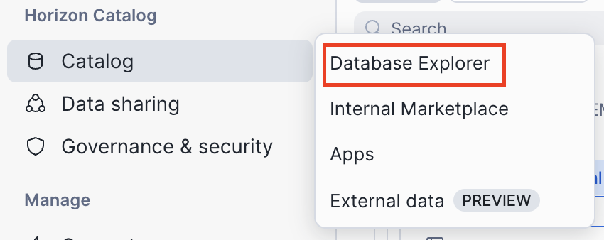

---

## 6. Query Iceberg Tables from Snowflake

Use standard SQL to query Iceberg tables stored in ADLS — no data copying required.

!!! abstract "What's happening"
    Snowflake reads the Iceberg metadata and data files directly from ADLS at query time — no data is copied or ingested into Snowflake. Because Iceberg is an open table format, these same files can also be queried by other compute engines (Spark, Trino, Flink) without duplicating data.

**58.** All your data is now available to query directly in Snowflake. These are Apache Iceberg tables — an open table format — meaning they are also available for other compute engines (e.g., Spark, Trino, Flink) to query in their respective environments.

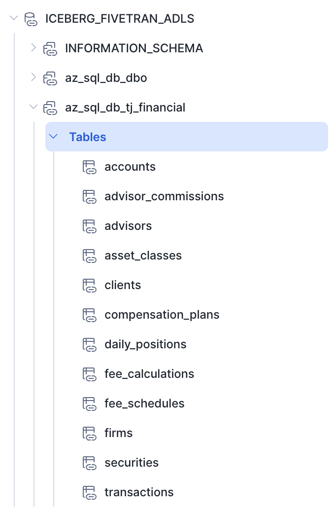

<br>

**59.** Query the data using standard SQL — it is fully queryable just like any other Snowflake table.

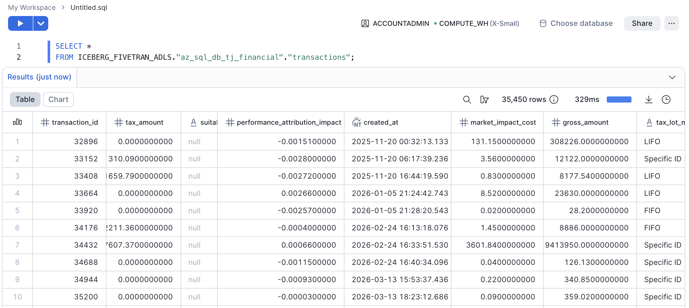

!!! success "Setup Complete"
    You have successfully configured an end-to-end pipeline: Fivetran syncs data from your source into ADLS as Iceberg tables, and Snowflake queries them directly through a catalog-linked database.

---

## Final State

| Component | Role |
|-----------|------|
| **Azure ADLS Gen2** | Data is stored as open Iceberg tables — accessible by any engine |
| **Fivetran** | Manages ingestion from your source and maintains the Iceberg catalog |
| **Snowflake** | Queries data directly from ADLS without copying or ingesting |
| **Auto-discovery** | As Fivetran syncs new data, tables automatically appear and update in Snowflake |
