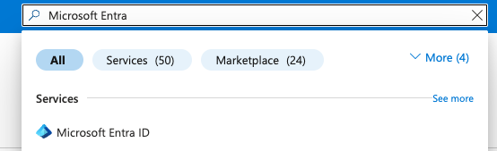
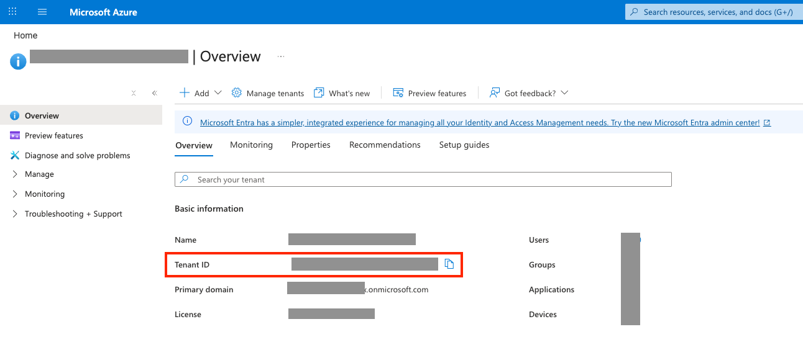
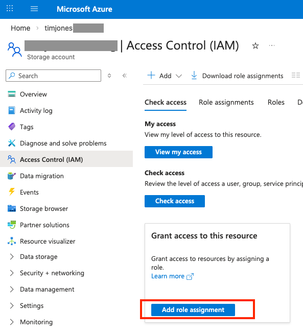
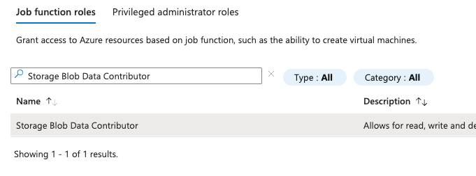
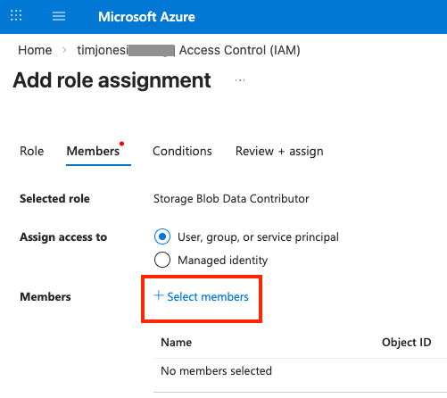
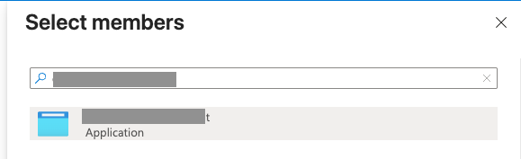
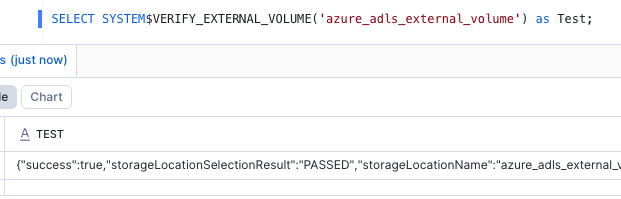
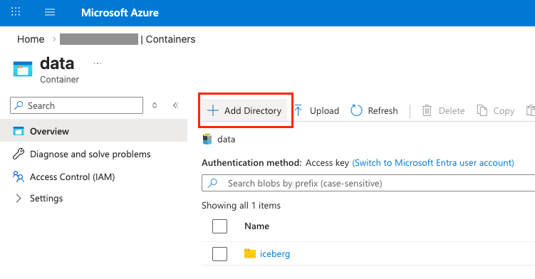
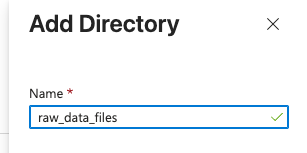

# Snowflake Managed Iceberg Tables (Azure)

Configure Snowflake-managed Apache Iceberg tables using Azure ADLS Gen2 as external storage.

!!! quote "Source of Truth"
    This guide is based on the official Snowflake documentation. Always refer to the official docs as the source of truth, as steps may change over time:
    [Configure an external volume for Microsoft Azure](https://docs.snowflake.com/en/user-guide/tables-iceberg-configure-external-volume-azure)

!!! warning "Adapt to Your Environment"
    This guide is a reference implementation demonstrated in a simplified environment.
    Your networking, security policies, IAM configurations, and infrastructure will differ.
    Always validate against your organization's requirements before implementing.

---

## 1. Provision Cloud Storage (Azure ADLS)

Create an Azure Storage Account with ADLS Gen2 to store Snowflake-managed Iceberg tables.

!!! abstract "What's happening"
    At this stage, you are creating the cloud storage layer where Snowflake will write Iceberg data files and metadata. Think of this as provisioning the "landing zone" for your open lakehouse.

!!! note "Environment-Specific"
    The storage account settings below are for demonstration. Consult your cloud/security team
    for your organization's required networking, encryption, and access configurations.

### Create a Storage Account

**1.** In the Azure Portal, search for **Storage accounts** and select it.


<br>

**2.** Click **Create**.


<br>

**3.** Fill in the **Basics** tab:

| Setting | Value |
|---------|-------|
| **Subscription** | Your Azure subscription |
| **Resource group** | Create new or select existing |
| **Storage account name** | Must be globally unique (e.g., `timjonesiceberg`) |
| **Region** | East US 2 (match your Snowflake region if possible) |
| **Preferred storage type** | Azure Blob Storage or Azure Data Lake Storage Gen 2 |
| **Performance** | Standard |
| **Redundancy** | Locally-redundant storage (LRS) — adjust to your requirements |

Click **Next: Advanced**.


<br>

**4.** On the **Advanced** tab, leave all defaults **except**:

!!! danger "Critical Setting"
    **Enable hierarchical namespace** must be checked. This is what makes the storage account
    ADLS Gen2 rather than standard Blob Storage. Without this, the Iceberg integration will not work.

!!! tip
    Review all other settings on this tab with your internal security team.


<br>

**5.** On the **Networking** tab, all defaults were left as-is for this demo.

!!! note
    Review networking settings against your internal networking requirements. Your organization
    may require private endpoints, specific firewall rules, or restricted virtual network access.


<br>

**6.** On the **Data protection** tab, uncheck **Enable soft delete for file shares**.

This setting applies to Azure Files, which we are not using in this setup.


<br>

**7.** On the **Encryption** tab, all defaults were left as-is.


<br>

**8.** On the **Tags** tab, no tags were added for this demo.

!!! tip
    In production, add tags that align with your organization's requirements (e.g., `Environment`, `Owner`, `CostCenter`).


<br>

**9.** Navigate to **Review + create**, review all selections, and click **Create**.


<br>

**10.** Once deployment completes, click **Go to resource**.


### Create a Container

<br>

**11.** In the left-hand pane, navigate to **Data storage** and select **Containers**.


<br>

**12.** Click **+ Add container**.


<br>

**13.** Give the container a name (e.g., `landing`) and keep all defaults. Click **Create**.


!!! success "Storage Setup Complete"
    Your Azure Storage Account and ADLS Gen2 container are now provisioned and ready for Snowflake to use as external storage for Iceberg tables.

---

## 2. Retrieve Your Azure Tenant ID

**14.** In the Azure Portal search bar, search for **Microsoft Entra ID** and select it from the dropdown.



<br>

**15.** On the **Microsoft Entra ID** overview page, locate and copy the **Directory (tenant) ID**. Save this value — you will need it when creating the external volume in Snowflake.




---

## 3. Create an External Volume in Snowflake

In Snowflake, open a **SQL worksheet**. We'll be creating an External Volume that points to your ADLS Gen2 container.

Reference documentation: [CREATE EXTERNAL VOLUME](https://docs.snowflake.com/en/sql-reference/sql/create-external-volume) — scroll to the **Microsoft Azure** section and use the **Data Lake Storage** URL format.

!!! abstract "What's happening"
    An External Volume tells Snowflake where your cloud storage lives and gives it the credentials needed to read and write Iceberg data files. Without this, Snowflake has no way to access your ADLS container.

**16.** Run the following SQL, replacing the placeholder values with your own:

!!! note "**You Can Also Use the Snowflake UI**"
    Rather than running SQL, you can configure the External Volume directly in the Snowflake web interface: [Configure an External Volume in the Snowflake UI](https://docs.snowflake.com/en/user-guide/tables-iceberg-configure-external-volume-azure?utm_source=chatgpt.com#configure-an-external-volume-in-sf-web-interface)

```sql
CREATE EXTERNAL VOLUME IF NOT EXISTS my_external_volume_name 
  STORAGE_LOCATIONS =
    (
      (
        NAME = 'your_chosen_name_here' -- This can be any value, it does not need to match the name of anything in Azure. It makes sense to name it the same as the external volume.
          STORAGE_PROVIDER = 'AZURE'
          AZURE_TENANT_ID = '<tenant_id>'
          STORAGE_BASE_URL = 'azure://<storage_account>.dfs.core.windows.net/<container>/' 
          --This should match the name of your storage account and container. Can include <path> after container name to provide granular control over logical directories in the container.
      )
    )
  ALLOW_WRITES = TRUE
  COMMENT = 'My external volume to connect to azure for Iceberg.';
```

!!! info "ALLOW_WRITES = TRUE"
    Setting `ALLOW_WRITES = TRUE` allows Snowflake to write Iceberg data and metadata files back to your storage. This is required for Snowflake-managed Iceberg tables.

!!! tip "Private Connectivity (Optional)"
    If your Snowflake account uses Private Link or private connectivity to Azure, you can add `USE_PRIVATELINK_ENDPOINT = TRUE` to your storage location configuration. This is not needed for standard deployments.

**17.** Once created, run the following to describe your external volume:

```sql
DESCRIBE EXTERNAL VOLUME my_external_volume_name;
```

<br>

**18.** Immediately after, run the following query to extract the key properties from the result:

```sql
SELECT 
    PARSE_JSON("property_value"):AZURE_MULTI_TENANT_APP_NAME AZURE_MULTI_TENANT_APP_NAME,
    PARSE_JSON("property_value"):AZURE_CONSENT_URL AZURE_CONSENT_URL,
    PARSE_JSON("property_value"):NAME AS NAME,
    PARSE_JSON("property_value"):STORAGE_REGION STORAGE_REGION,
    PARSE_JSON("property_value"):AZURE_TENANT_ID AZURE_TENANT_ID
FROM TABLE(RESULT_SCAN(LAST_QUERY_ID()))
WHERE "property" = 'STORAGE_LOCATION_1';
```

!!! important "Copy These Values"
    From the query results, copy out the **`AZURE_CONSENT_URL`** and **`AZURE_MULTI_TENANT_APP_NAME`** — both will be needed for the remaining configuration steps.

    See: [Step 2: Grant Snowflake Access to the Storage Location](https://docs.snowflake.com/en/user-guide/tables-iceberg-configure-external-volume-azure#step-2-grant-snowflake-access-to-the-storage-location)

---

## 4. Grant Snowflake Access to the Storage Location

**19.** In the Azure Portal:

- Open your **storage account**
- Go to **Access control (IAM)**
- Click **Add role assignment**



<br>

**20.** Search for **Storage Blob Data Contributor**, select it, and click **Next** at the bottom of the screen.



<br>

**21.** Click **+ Select members**.



<br>

**22.** Search for the Snowflake-generated service principal using the value from `AZURE_MULTI_TENANT_APP_NAME`, select it, then click **Review + assign** to finish.

!!! tip "Search Only the Prefix"
    Remove everything after the underscore in the `AZURE_MULTI_TENANT_APP_NAME` value — that portion is a timestamp. Only search for the text **before** the underscore.



<br>

**23.** Copy the `AZURE_CONSENT_URL` from the query results and paste it into your browser. Sign in as an Azure Admin and approve the application. This allows Snowflake's service principal to access your tenant.

Wait 1–2 minutes for Azure RBAC propagation before proceeding.



<br>

**24.** Back in Snowflake, run the following to verify the external volume is working:

```sql
SELECT SYSTEM$VERIFY_EXTERNAL_VOLUME('my_external_volume_name') AS Test;
```

Ensure the output begins with `"success":true`.

!!! success "External Volume Ready"
    Your external volume is now fully configured. You're ready to start creating Snowflake-managed Iceberg tables that can be queried by Snowflake and other engines — including Apache Spark, Trino, and Flink — emphasizing the open, interoperable nature of the Iceberg format.

---

## 5. Create Your First Iceberg Table

Now for the fun part — let's create a Snowflake-managed Iceberg table and insert some data!

!!! abstract "What's happening"
    Snowflake will write both the Parquet data files and Iceberg metadata files directly to your ADLS container. After inserting data, you can browse your storage account in Azure and watch the files appear in real time.

**25.** Run the following SQL in a Snowflake worksheet:

```sql
CREATE DATABASE IF NOT EXISTS bronze;
CREATE SCHEMA IF NOT EXISTS test;

CREATE OR REPLACE ICEBERG TABLE bronze.test.customer_sales (
  id INT,
  customer STRING,
  amount NUMBER(10,2)
)
  CATALOG = 'SNOWFLAKE'
  EXTERNAL_VOLUME = 'my_external_volume_name'
  BASE_LOCATION = 'iceberg/customer_sales/'
  ICEBERG_VERSION = 3;

INSERT INTO bronze.test.customer_sales (id, customer, amount)
VALUES
  (1, 'Acme', 100.25),
  (2, 'Globex', 250.00),
  (3, 'Initech', 75.50);
```

Once the insert completes, head over to your Azure storage account and navigate to the container. You should see Iceberg metadata files and Parquet data files being written to the `BASE_LOCATION` path — proof that Snowflake is managing the full Iceberg table lifecycle in your own storage.

!!! tip "Open by Design"
    Because these are standard Iceberg tables backed by open Parquet files, they can be read by other engines — Spark, Trino, Flink, and more — directly from the same ADLS location, with no data copying required.

    See: [Access Iceberg tables using an external query engine](https://docs.snowflake.com/en/user-guide/tables-iceberg-access-using-external-query-engine-snowflake-horizon)

---

## 6. Create a Storage Integration

If you want to use an Azure **External Stage** in Snowflake (e.g., to load or unload files), you'll also need a Storage Integration.

!!! warning "Use `.blob`, not `.dfs`"
    Even though we configured the External Volume using the Data Lake Storage `.dfs.core.windows.net` endpoint, Azure External Stages in Snowflake expect the **Blob** endpoint: `.blob.core.windows.net`. Using `.dfs` won't necessarily break, but `.blob` is the correct endpoint for external stages.

!!! info "No Need to Repeat Consent"
    Because you already granted Snowflake access to your storage tenant during the External Volume setup (consent URL + app registration), **you do not need to repeat those steps**. The code below is shown for visibility — the `AZURE_CONSENT_URL` and `AZURE_MULTI_TENANT_APP_NAME` steps are already complete.

```sql
USE ROLE ACCOUNTADMIN;

CREATE OR REPLACE STORAGE INTEGRATION azure_storage_integration
  TYPE = EXTERNAL_STAGE
  STORAGE_PROVIDER = AZURE
  ENABLED = TRUE
  AZURE_TENANT_ID = '<tenant_id>'
  STORAGE_ALLOWED_LOCATIONS = (
    'azure://<STORAGE ACCOUNT NAME>.blob.core.windows.net/<CONTAINER NAME>'
  );

-- Because we already did this in the external volume setup, we don't need to do this again.
-- Including code here for visibility.
DESCRIBE STORAGE INTEGRATION azure_storage_integration;

SELECT 
    "property",
    "property_value"
FROM TABLE(RESULT_SCAN(LAST_QUERY_ID()))
WHERE "property" IN ('AZURE_CONSENT_URL', 'AZURE_MULTI_TENANT_APP_NAME');
```

---

## 7. Create an External Stage

**26.** In your Azure storage container, create a new directory. Give it a name and click **Save**.



<br>



<br>

**27.** Upload your data files to the directory you just created in Azure. You can do this directly from the Azure Portal by navigating into the directory and using the **Upload** button.

!!! tip "Sample Data"
    Don't have sample data handy? Download these Titanic dataset files to use for testing:

    - <a href="../assets/titanic.csv" download>titanic.csv</a>
    - <a href="../assets/titanic.parquet" download>titanic.parquet</a>

<br>

**28.** Back in Snowflake, create an External Stage pointing to your Azure storage location:

!!! tip "Keep the Path Flexible"
    The path after the container name is optional. For maximum flexibility, consider creating the stage at a **higher-level directory** and navigating to subdirectories within the stage as needed — rather than locking the stage to a deeply nested path.

```sql
CREATE OR REPLACE STAGE raw_stage
  STORAGE_INTEGRATION = azure_storage_integration
  URL = 'azure://<storage_account>.blob.core.windows.net/<container>/<optional_path>/';
```

!!! warning "Use `.blob`, not `.dfs`"
    As noted earlier, External Stages in Snowflake require the **Blob** endpoint (`.blob.core.windows.net`), not the Data Lake Storage endpoint (`.dfs.core.windows.net`).

Once created, you can list the files visible to the stage using:

```sql
LIST @azure_stage/raw_data_files/;
```
